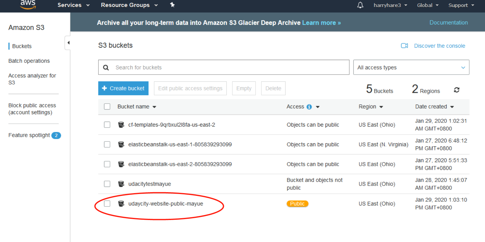
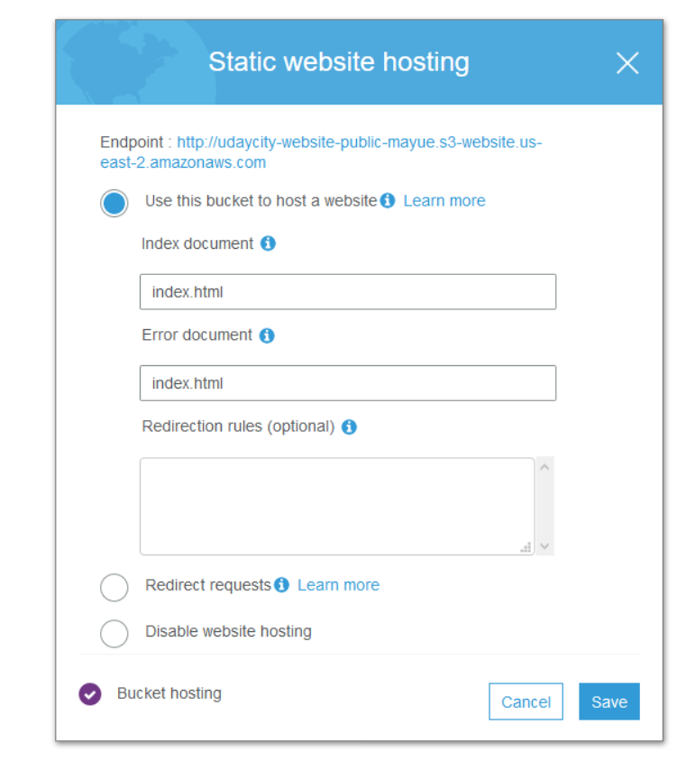
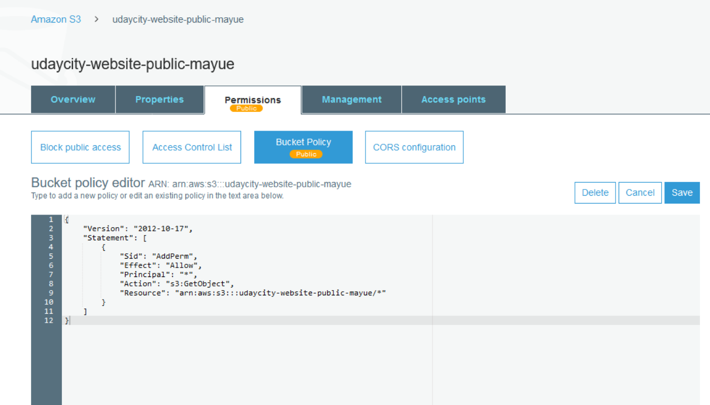
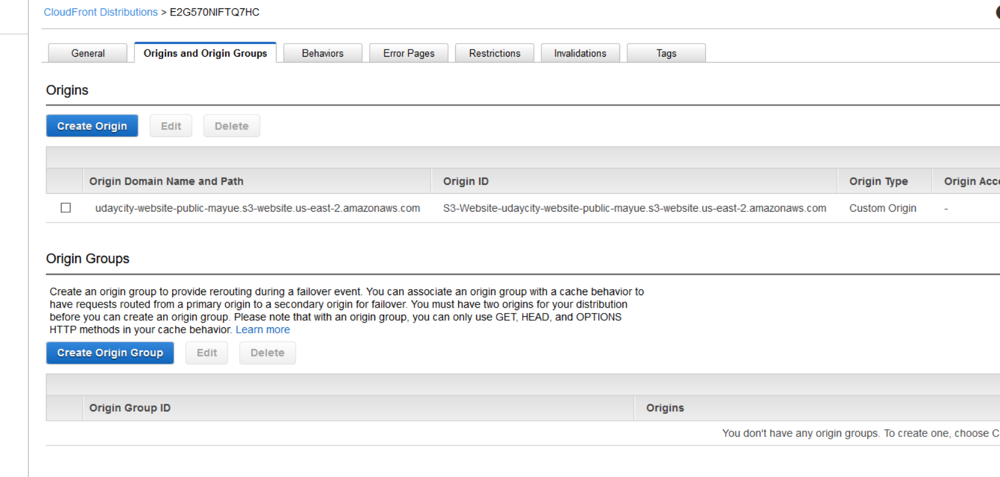

### github url

```
https://github.com/harryhare/udacity_cloud_ops_course/tree/master/l1

```

### websit url

```
http://d15zks29kg5wqc.cloudfront.net/index.html
```

### screenshots

* s3 bucket


* files upload


* website hosting


* policy


* cloudfront configuration


* website screenshots


