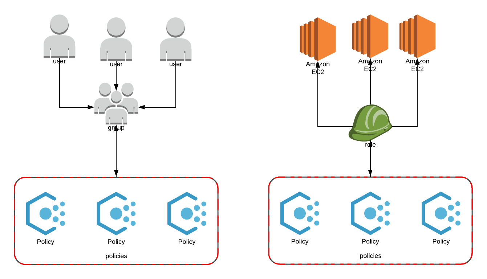

## lesson 1

### AWS IAM

- group 包括 一组 policy 
- user 可以加入到 group 中
- role 也可以包括 一组 policy
- role 注意是attach 到 aws 和 lambda 的, 不过也可以和user 绑定
- user 可以直接attach policy
- policy 可以 自定义，policy 包括最资源和读写的详细定义

一般的操作是：

create policy -> create group -> create user

总结就是：



### 
```
echo "kibanaadmin:`openssl passwd -apr1`" |sudo tee -a  /etc/nginx/htpasswd.users
```
```
server{
	listen 80;
	server_name http://34.212.82.158;
	
	auth_basic "Restricted Access";
	auth_basic_user_file /etc/nginx/htpasswd.users;
	location /{
		proxy_pass http://localhost:5601;
		proxy_http_version 1.1;
		proxy_set_header Upgrade $http_upgrade;
		proxy_set_header Connection 'upgrade';
		proxy_set_header Host $host;
		proxy_cache_bypass $http_upgrade;
	}
}
```


## lesson 3


project 位置，k45vd-ubuntu:~/git/ansible_playground/nginx_ansible

* ansible
	```
	apt install ansible
	ansible -m setup localhost
	ansible-playbook -i my_hosts -a SE_LINUX=”true” init_servers.yaml
	```
* lsof 查看80 的情况要加sudo 否则返回结果是空
	```
	sudo lsof -i:80
	```

## lesson 4
