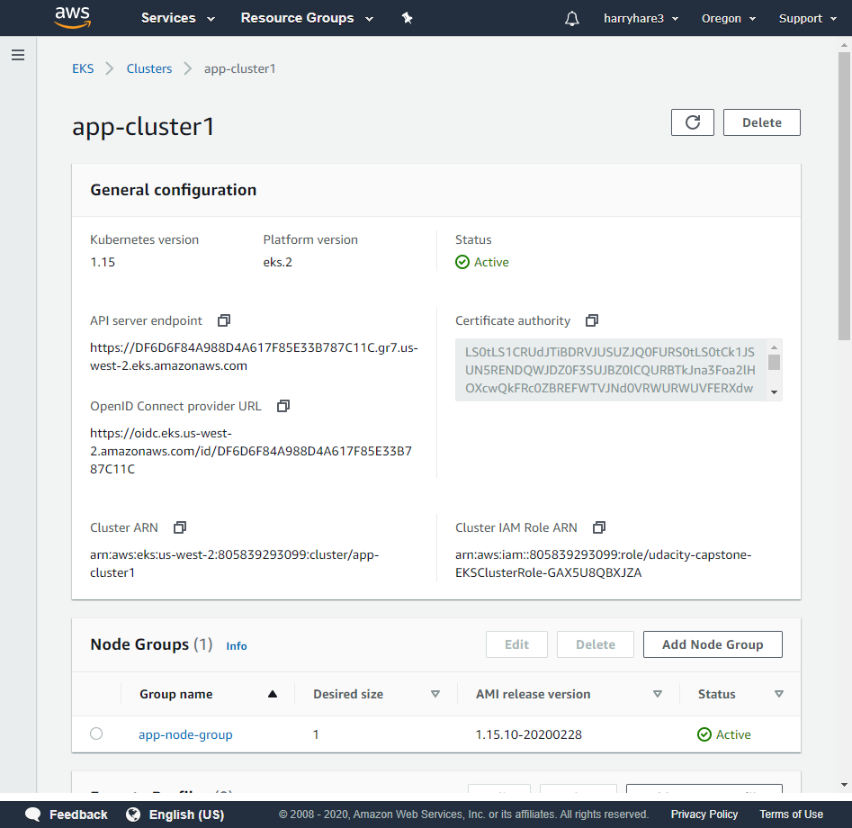
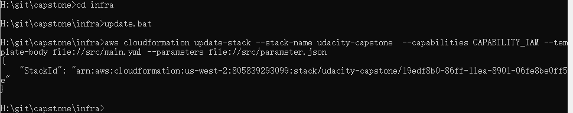

# capstone project for udacity cloud ops course

## Intro

- Project

	- html project
	
		Hello World, my name is (student name)
		
	- tool
	
		nginx
		
	- code
	
		`./project`

- Infra

	- resrouce
	
		aws kubernetes: EKS
		
	- tool
	
		cloudformation
		
	- code
	
		`./infra`
		
- CI/CD

	- tool
	
		- Jenkins
		
		- Kubernetes
		
	- deployment
	
		kubernetes rolling
		
	- code
	
		- `./kubernetes`
		
		- `./Jenkinsfile`
		
	- other
		- aws configure set up by hand
		
		- docker regstry login by hand
		
		- kubernetes auth set up by hand

## Screenshots

- Lint

	- lint error
	
		
		
	- lint pass
	
		

- Pipeline & Rolling 
		
	- pipeling & kubernetes rolling
	
		
		
	- ec2
	
		
		
- Cloudformation
	
	- aws eks console
	
		
	
	- cloudformation stack
	
		
		
	- cloudformation run
		
		
		